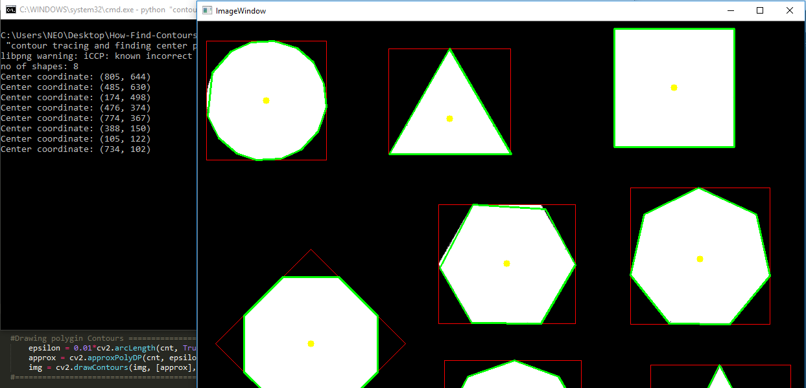
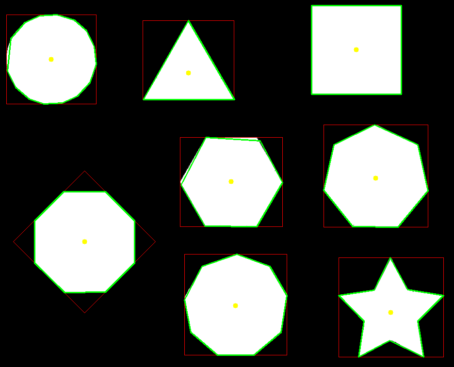

### OpenCV Find Contours and their Center Points

Hello There Curious Researchers! in this section, i have pushed a ready to use code to find contours on shapes and their center points. This comes in handy while building up a project where it required to trace an object for image processing, check out my other repositories for more useful codes.

##### Required Modules

````python
>> pip install opencv-contrib-python
>> pip install numpy
````

#### Running the code

> Start ``find_contours.py`` you will see output something similar to below image.
>
> 


> Input Image ``shapes.png``
>
> 


> Output Image ``output.png``
>
> 